# Byron’s Barbershop API

### ****R1 - Identification of the problem you are trying to solve by building this particular app.****

Byron, the Barber, is back for an exclusive time, a pop-up store just for one day. He has many customers who wait for this momentous occasion which occurs relatively infrequently. Byron requires a system to manage bookings, which is seamless, robust, and secure, rather than make his clients have to line up and wait for their turn.
In this day and age, there are too many barbershops where clients walk in and sit around for their turn for a few hours—turning what should be a calming, soothing experience into a chore. However, with this Barbershop booking API, there is no more waiting, registering, logging in, and managing your appointment.
This barbershop booking API will allow users to register their details, log in, create an appointment, manage that appointment, and cancel it if necessary. Byron the Barber will be able to view the appointments and manage the bookings to ensure a seamless experience for the customer. Users can view what available services, as well as the times they can book. To make it more social, users can view other appointments too! This will allow them to find out what time their friends are going and book slots around them so they can spend their time, bonding over some good ol’ fashion Barbershop chats.

### ****R2 - Why is it a problem that needs solving?****

Customers are drawn away with long wait times, which loses barbershops without a booking system, high amounts of revenue. If customers do decide to wait their turn, frustrations mount which results in a terrible experience. For barbers that are high in demand, and don’t want to lose revenue, this app solves both these issues. Customers who are drawn away from wait times, can book pre-available time slots, of their choice to suit their day ‘s schedule which makes them more inclined to get a fresh haircut. Customers can also walk out happy, knowing they haven’t wasted their day waiting around for a hair cut. 

For Byron, this problem being solved allows more return customers (next time he does a pop up store), happier customers as well as more flexibility around when he is required to be at the shop.

Another reason for a system over just a phone call booking, is that if customers decide to change their mind on the service, the time, or cancel the booking entirely, they do not have to phone Byron over and over again. On the recieving end, Byron does not need to manage what time everyone is coming, and keep iterating changes that may arise in a day.

The app solves all these issues as it becomes a medium of exchange for communication.

### R3 - Why have you chosen this databse system. What are the drawbacks compared to others?

A database management system (DBMS) is software used to manage databases. For this app we have chosen PostgreSQL as their database management solution. PostgreSQL offers numerous benefits to its constructed web application; however, there are some drawbacks that we will outline, especially in regards to other DBMS.

**Pros of PostgreSQL**

- **Entirely open source** - grants permission to use, copy, modify, and distribute the software; it is publicly accessible
    - This allows for changes and improvements in the form of iterations can occur.
    - It will allow us build our own modules on top for sharing purposes.
    - Also allows for good community support
- **Object Oriented DBMS design**
    - Allows for features such as table inheritance, function overloading
    - As a result, it is more robust to use with any language that is implemented with object-oriented fundamentals.
    - PostgreSQL also has the added advantage of being able to run NoSQL processes because it can query and store JSON. JSON data will be used in the body of all requests and JSON will be returned to the user in all responses.
- **Low maintenance**
    - To run and administer Postgresql, there is low maintenance for both the embedded versions and enterprise use for PostgreSQL.
    

**Cons of PostgreSQL**

- Slower Perfromance compared to other types of DBMS
    - performs slightly slower than other options, particularly in the area of reading speeds.
- Lower support as there are fewer hosts as a result of PostgreSQL still being used less than other DBMS.
- Less flexibility of data fields compared other types of DBMS such as NoSql.

After factoring these all in, we look at our requirements for the client Byron.

- **Cost**
    - Cost was a major factor when choosing a database technology for this forum API. PostgreSQL is an open-source cost effective solution that provides a great alternative compared to similar licenced RDBMS.
- **Reliability/Security**
    - PostgreSQL is known for its reliability, robustness and its ability to create and use complex queries.
- **Scalability**
    - PostgreSQL is built with scalability, data integrity and extensibility in mind.

After factoring the client needs, and the advantages that PostgreSQL has to offer, we have decided to use this DBMS as it is an efficient database that will keep costs low. It is reliable and secure, which allows for complex queries, and finally it scales well with increased users. This in turn will generate higher revenue, while keeping costs low for Byron, the barber.

### R4: ****Identify and discuss the key functionalities and benefits of an ORM.****

An Object Relational Mapper (ORM) is a language specific module or library that acts as a bridge between data stored in a relational database and objects created in application code. In our case, we have used SQL Alchemy.

The key features of an ORM, which in our case is SQLAlchemy, are a library of functions that allow the developer to interact with the database through the application. This not only allows you to create user-friendly methods for accessing the database, but it also allows you to improve database security through data sanitization practises. Another advantage is that it forces you to write code using the MVC architecture, which keeps the code clean and more DRY overall.

**Features**

A  model of a User that maps to a table of user data from a PostgreSQL database is shown below.

```python
class User(db.Model):
    __tablename__ = 'users'

    id = db.Column(db.Integer, primary_key=True)
    f_name = db.Column(db.String(64), nullable = False)
    l_name = db.Column(db.String(64))
    email = db.Column(db.String(), nullable = False, unique = True)
    password = db.Column(db.String(), nullable = False)
    phone = db.Column(db.String(40))
    is_admin = db.Column(db.Boolean(), default=False)

    #relationships
    appointment = db.relationship('Appointment', back_populates = 'user', cascade = 'all, delete', uselist = False)
```

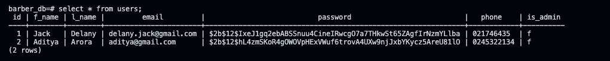

For each new record in the table, a new instance of the User class would be generated, and the data in each column of the database record would be mapped into each corresponding attribute of the object. For example, the object below could be used to generate user id 3.

```python
data = UserSchema().load(request.json)
try:
        user = User(
            email = data['email'],
            password = bcrypt.generate_password_hash(request.json['password']).decode('utf-8'),
            f_name = data.get('f_name'),
            l_name = data.get('l_name'),
            phone = data.get('phone')
        )
        db.session.add(user)
        db.session.commit()
        return UserSchema(exclude=['password']).dump(user), 201
    except IntegrityError:
        return {"error": 'Email is already in use, please use another email address'}, 409
```

Object Relational Mapping enables developers to alter database data structures using Object Oriented Programming languages. This implies that instead of writing SQL queries, developers may execute CRUD activities on databases using the language of their choosing. For example, the SQL query below will return a list of all the users in a database.

```sql
select * from users;
```

However, the same can be achieved using python in SQL Alchemy, as seen below

```sql
@user_bp.route('/all_users/', methods = ['GET'])
@jwt_required()
def get_all_users():
	  stmt = db.select(User).order_by(User.l_name)
    users = db.session.scalars(stmt)
    return UserSchema(many = True, exclude =['password']).dump(users)
```

**Benefits**

An advantage of using ORMs is that it can convert the value of each colum in a database to a table into an object property. This property may now be read and changed in application code, then committed or written back to the database. The ORM is also used in reverse to turn manipulated data back into a database-readable format. 

Another advantage of is that ORMS can also use class’ attributes which correspond to columns in the database table. This means that every object instance is effectively linked to a single row or record in that table. Within these objects, we can also perform CRUD operations. 

Speed and efficiency benefit of ORMs is an added bonus since developers don't have to switch back and forth between the language used to code. The application and the language used to query. The database structures, this ability to query the database and develop an application in one language has the potential to speed up the development of an application in its early stages.

Another benefit is that ORMs are also database platform agnostic, which means that an application may be designed with one database and subsequently moved to another with little modifications to the application code. Although it is theoretically possible to use PostgreSQL in a staging environment and then switch to MySQL in a production environment without too much difficulty, this is not a good practise because unforeseen errors in the production environment that were not tested for in the staging environment could occur.

### R5 - API Endpoints Documentation

Refer to documentation [here](docs/endpoints.md)

### R6 - An ERD for your app

 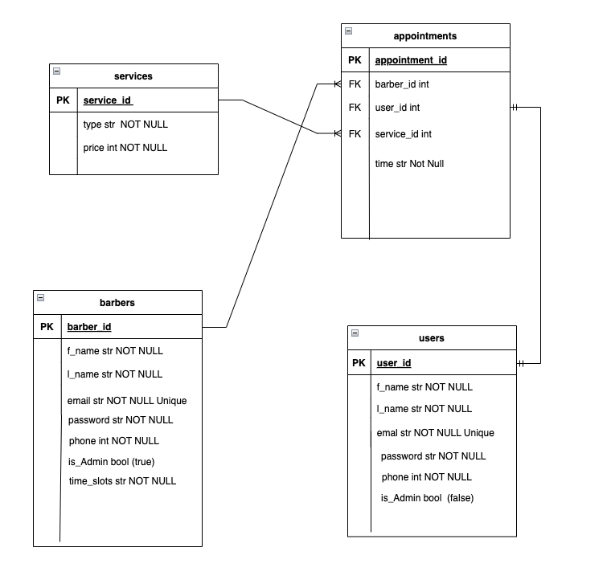

### R7 - Detail any third party services that your app will use.

- **SQL ALCHEMY**
    - SQL Alchemy is a Python module that acts as a link between both the main application code and the PostgreSQL database architecture. It's used as an ORM (Object Relational Mapper) to convert PostgreSQL tables into Python objects and vice versa. To integrate and communicate with the database tables, it employs Python function calls to generate statements that are transformed to SQL statements. Data from PostgreSQL databases is also translated into OPP languages for manipulation in the application.
- **MARSHAMALLOW**
    - *flask-marshmallow*
        - This third-party library is utilised in several places across the forum API. It is used to generate schemas for converting JSON to and from SQLAlchemy and Python objects. It also serialises application-level objects to Python basic types. These serialised objects can then be translated into common forms, such as JSON, for usage with Web APIs. To validate request body inputs to an API, schemas may also utilise Marshmallow's validation methods.
    - *marshmallow- exceptions*
        - This is part of the marshmallow module, it allows for exceptions to be raised when recieiving input. Through out the project exceptions have been used to validate schemas, and input.
- **JWT-EXTENDED**
    - This library is used to generate tokens that may be used to grant authorised users access to API services without requiring login information for each request. JSON Online tokens have become the industry standard for accessing web applications, allowing a server to decode a token's content to authenticate users into a system. JWTs are an excellent blend of basic and bearer tokens. Bearer tokens are more difficult to manage since they must be maintained in a database, whereas basic tokens are too simple to penetrate. JWTs have combined the advantages of both types of tokens to create a simple and safe token that is easy to manage because no database is required and significantly more secure than a basic session token.
- **BCRYPT**
    - Flask bcrypt is a third-party package that enables developers to safeguard passwords using bcrypt hashing methods. Bcrypt is based on the Blowfish cypher and employs salting, which adds an additional element of unpredictability to the hash to better encrypt and secure sensitive data. The bcrypt hashing functions are designed to be slow in order to provide additional security against brute force assaults. The slower the hashing function, the more secure.
    - 
- **PSYCOPG2**
    - This acts as a bridge between the PostgresQL database and flask application.
    
- **python-dot-env**
    - This module enables a Flask application to access and use sensitive data, such as secret keys for hashing passwords and saving database url links. Instead of hardcoding these values into the programme, which is insecure, they may be configured as key/value pairs in a.env file, as seen below.
    
- **pip review**
    - pip-review is a module that displays a list of Python Packages Index packages that are newer than the versions presently installed in a Python environment. The `pip-review` programme will provide a list of currently installed packages with updated versions on PyPi. Running `pip-review -aC` will scan for newer versions of packages and instal all of the newest versions in the current Python environment.

### R8 - Describe your projects models in terms of the relationships they have with each other.

In terms of the SQL Alchemy Models in the Barbershop booking API, they are related to the data that needs to be stored and manipulated for each entity. In particular, we have Users, Appointments, Services and Barbers. 

Each of these are derived from the base class of `db.Model` from SQLAlchemy, and in addition they have unique attributes that describe the entity. Appointments in particular is used to create one to one and one to many relationships that join Services, Users and Barbers for a normalised relational database. 

Lets take a look at these Models in full as well as their relationships, we will start with Users, Barbers, Services then Appointments as models

Subsequently, we will look at the schemas that allow us to relate the models in SQLAlchemy and work with Marshmallow to return JSON requests. 

**Users Model**

This SQLAlchemy model has attributes that is used to store information for a new user. Things such as their first name, last name, email, phone number and password. It does not have any foreign keys , however it does have a relationship with the Appointments Model. Users can have zero to one appointments, and this is done through creating a relationship on the side of User, as shown below. On the other side of this relationship there is Foreign Key and relationship that we will show under Appointments. 

```sql
appointment = db.relationship('Appointment', back_populates = 'user', cascade = 'all, delete', uselist = False)
```

The cascade all delete is required, so that if a user deletes their details, their left over appointments are also deleted. 

**Barbers Model**

This SQLalchemy model has attributes that is used to store information about the barber, the fields are similar to that of User model. Barbers also do not have any foreign keys since this is the parent table, and the appointments is the child table, but do have a relationship with Appointments. An appointment only has one barber, but a barber can have many appointments. As you can see with the code below, the relationship variable is pluralised to reflect this, since appointments back_populates the barber, this relationship shows that a barber can have many appointments. 

```sql
appointments = db.relationship('Appointment', back_populates = 'barber', cascade = 'all, delete')
```

The cascade all delete is required here so that if the barber is deleted, so are their still active appointments. 

**Services Model**

This SQL Alchemy Model has attributes that display and store information about the services available at the barbershop. Attributes include things such as price and type of service. For normalilsation and avoiding duplication, this model also does not have any Foreign Keys either since it is a parent table, with the appointments being the child table, however it does have a relationship with Appointments. Each appointment can have one service, and a service can be in many appointments. This is shown in the code below. We have also included a cascade all delete, in the event that a service is removed, all the appointments with that particular service are also removed. 

```sql
appointments = db.relationship('Appointment', back_populates = 'service', cascade = 'all, delete')
```

**Appointments Model**

This SQLAlchemy Model has attributes that derive foreign keys from all the parent tables such as Serivces, Users and Posts, and create a two way relationship. It also has its own personal attribute. From the below code snippet, we can see that an appointment will have one user, one barber and one service, alongside a time. These relationships are show like so:

```sql
#foreign keys
    user_id = db.Column(db.Integer, db.ForeignKey('users.id'), nullable = False)
    barber_id = db.Column(db.Integer, db.ForeignKey('barbers.id'), nullable = False)
    service_id = db.Column(db.Integer, db.ForeignKey('services.id'), nullable = False)
    
    #relationships
    #appointment can have one user
    user = db.relationship('User', back_populates = 'appointment', uselist = False, cascade = 'all, delete')
    #appointment can have one barber
    barber = db.relationship('Barber', back_populates = 'appointments', cascade = 'all, delete')
    #appointment can have one service.
    service = db.relationship('Service', back_populates = 'appointments', cascade = 'all, delete')
```

Notice that the variables have been left singlular, as well as included a cascade all delete, in the event that if a barber, user or a service is deleted, that appointment is deleted. 

Now we will discuss the Marshmallow schemas. When displaying results to the end user, the Marshmallow schemas defined in this API will make advantage of the above relationships between the models. A fields variable is contained within a `class Meta`statement in each schema. When that schema is invoked, each of the attributes included within the fields tuple will be shown.

**User Schema**

The attributes are as shown below, listed within the fields, however there is an additional field ‘appointments’. This is to signal that there is a relationship between the two. The extra field is data that we ant to be display with each user, so if a user has an appointment, it will show their appointment details in JSON format. To achieve this we have created a relationship using `fields.Nested` within the schema, which allows a serialised object return when viewing users. 

```python
#User Schema
appointments = fields.Nested('AppointmentSchema', exclude =['user'])
class Meta:
        fields = ('id', 'f_name', 'l_name', 'email','phone','is_admin', 'password', 'appointments')
        ordered = True
```

Note that this excludes the user, as we are displaying a result with the user’s details already present to gather only the absoluten neccessary information required per request. 

**Barber Schema**

The attributes are as shown below, listed within the fields, however there is an additional field ‘appointments’. This is to signal that there is a relationship between the two. The extra field is data that we want to be display with each barber, so if a barber has an appointment, it will show their appointment details in JSON format. To achieve this we have created a relationship using `fields.Nested` within the schema, which allows a serialised object return when viewing users. 

```python
appointments = fields.List(fields.Nested('AppointmentSchema', only = ['id', 'time', 'service', 'user']))

class Meta:
        fields = ('id', 'f_name', 'l_name', 'phone', 'email', 'password', 'appointments','is_admin', 'time_slots')
        ordered = True
```

Notice this time we have only incuded the appointment ID, the time, service and the user it relates to. 

This again is done to hit the balance of providing additional information per request without over loading information that might be duplicated in a request. 

Since a barber may also have many appointments, this is shown using `fields.List`to return many nested appointments if that particular barber may have them. 

**Service Schema**

Although there exists a relationship between appointments and services, in the schema, we have not defined appointments. This is done on purpose as it is unlikely, and deemed uneccessary to request a list of services, with each service having an appointment listed under the service. This is a request that is tackled via viewing appointments, viewing users’ appointments or barbers appointments, which are robust enough that this particular method will not be required. 

**Appointment Schema**

Since we have outlined all the relationships previously, we have to include them in the schema aswell. the relationships are outlined below

```python
		user = fields.Nested('UserSchema', only=['id','f_name','l_name'])
    barber = fields.Nested('BarberSchema', only=['f_name','l_name'])
    service = fields.Nested('ServiceSchema', exclude=['id'])

		class Meta:
        fields = ('id','time', 'barber', 'service', 'user')
        ordered = True

```

In this case, since there are relationships between user and appointment, barber and appointment, service and appointment we have included all these in the fields, as well as the relationships defined within the schema. This allows queries to be made for any appointment, where the user’s details, barber’s details and service’s details will be returned. This relationship again allows us to maximise the information in JSON request, while maintaining information overload.  As previously shown, we have again used Nested fields to return the JSON request. 

### R9 - Discuss the database relations to be implemented in your Application

The database that wil store the data and relationships in the Barbershop API consists of 4 tables; Users, Serivces, Barbers and Appointments.

Each table has columns that represent an attribute, the tables include a primary key denoted by the table’s ID, which makes the table uniquely identifiable when using it to relate other tables in the databse. There are also Foreign keys that are used particularly in the Appointments table. 

Relationships between these tables will be built by associating the primary key in one table with an extra attribute in another table known as a foreign key. The foreign keys are also termed id, but they are prefixed with the table with which they are associated.

As you can see in the ERD. The primary keys of ‘users’, ‘services’ and ‘barbers ‘are used as foreign keys in ‘appointments’. This shows that there is a relationship between these tables. The foreign keys are named as the foreign key id to denote that this key is coming from the primary key of another table which is named. For example ‘user_id FK’ in ‘appointments’ is related to the ‘users’ table.

The relationships are denoted using crow’s feet notation which allow us to view the type of relationship it is at a glance within the ERD. We will also explain the relationships between these tables in more details below. 

- A user has zero to one relationship with appointments. This means that a user can have either 0 appointments, or 1 appointment. As a result, if there is an appointment, that appointment will have a user_id showing in the table.
- A barber can have mandatory one to many relationships with appointments. This means that a barber may have many appointments, however an appointment may only have one barber. As a result we have included the barber_id in the appointment table
- A service has one to many relationship with appointments. This means that an appointment must have one service, however services can have many appointments. In the tables, if there is an appointment, the service of that appointment is denoted by the service_id column.

For normalisation of our tables, we have not included users to show appointments within the users table, or appointments within the barber table, or appointments within the services table. These can all be accessed via querying the appointments table, should the information be required. 

### R10 - Describe the way tasks are allocated and tracked in your project

Firstly, this will show the main features outlined above, and how they were implemented using a checklist of subtasks. Then display the day to day operations of the Kanban board while creating this project.****

For this Barbershop API, I set out a a list of user stories that I wanted to apply to this project. All the tasks were written within these user stories, until all the requirements of that story were complete. Then it was onto the Kanban Board. For this I used Trello, to keep track of the tasks for the duration of the project. 

In this case the 4 stages each task user story went through were:

1. Backlog
2. To-Do
3. Doing
4. Testing
5. Done

All new tasks were first added to the backlog, upon pondering of which tasks to start with, they were moved to the To Do stage. I limited the To Do section to all the tasks per user story. Tasks were also assigned time frames, for scenarios where there was limited motivation to do the task, I would start with the shorter tasks, then build momentum towards the bigger tasks which proved to be a good technique. 

Over the course of the project, the stories would move across from Doing to Testing, and from Testing, back to Doing on numerous ocassions. Especially the user stories which involved a high level of querying and creating routes. Once all the tasks set out in the user story were in the the Testing Stage. I would re-test all routes/tasks one final to before  adding new users stories from my backlog into To Do and subsequently Doing.  This was repeated till completion of the project. 

Below are screenshots of tasks in a user story, and how the board moved on a day to day basis. 

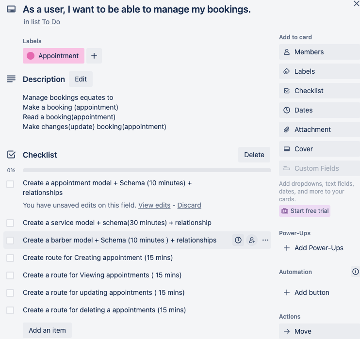
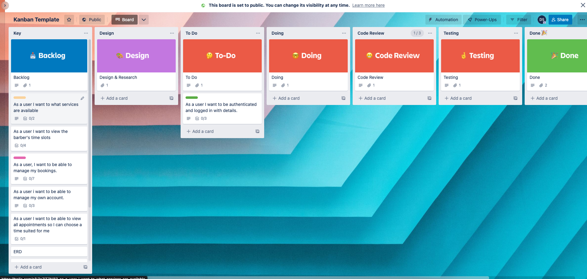
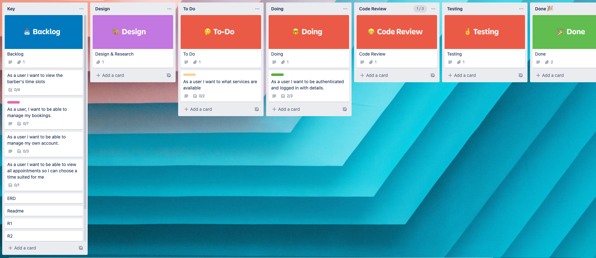
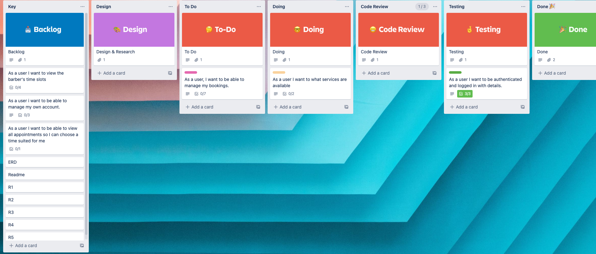
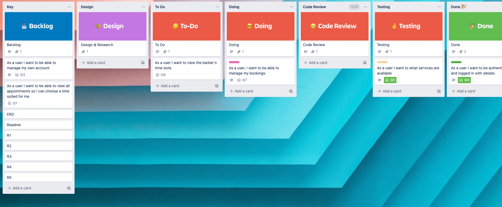
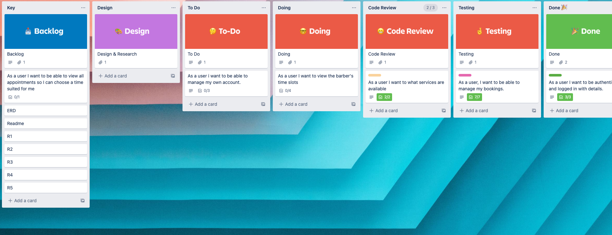
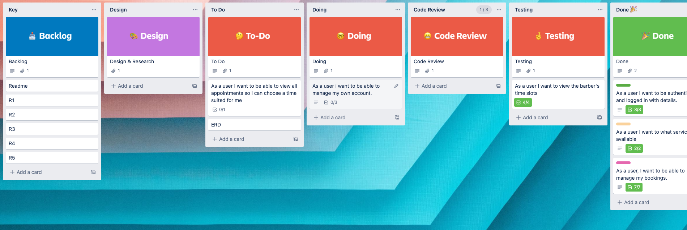
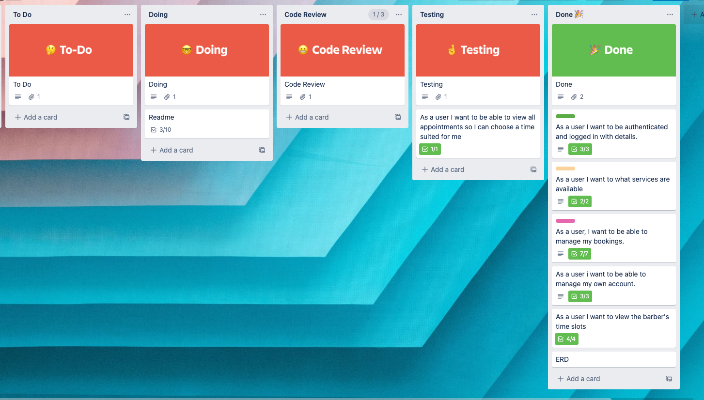
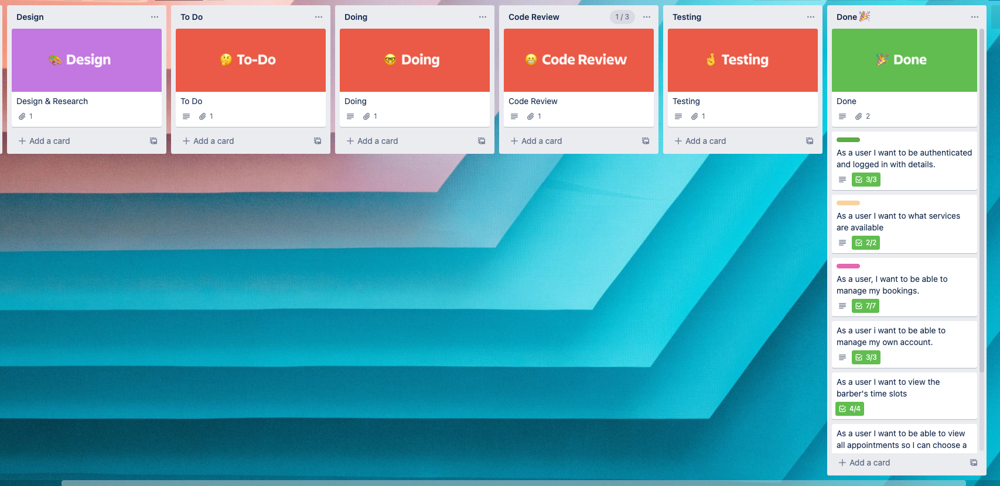 


### **Postgresql instructions to set up database**

- Create database

`CREATE DATABASE barber_db;`

- Create user

`CREATE USER barber_dev WITH PASSWORD 'password123';`

- Grant privileges

`GRANT ALL PRIVILEGES ON DATABASE barber_db TO barber_dev;`


### References

Peterson, R. (2022, October 15). *What is postgresql? introduction, advantages & disadvantages*. Guru99. Retrieved October 23, 2022, from https://www.guru99.com/introduction-postgresql.html 

EDUCBA (2022)) *[Flask bcrypt](https://www.educba.com/flask-bcrypt/),*  EDUCBA website, accessed 10 November 2022. 

Editor. (2021, March 11). *Understanding object-relational mapping: Pros, cons, and types*. AltexSoft. Retrieved November 13, 2022, from https://www.altexsoft.com/blog/object-relational-mapping/